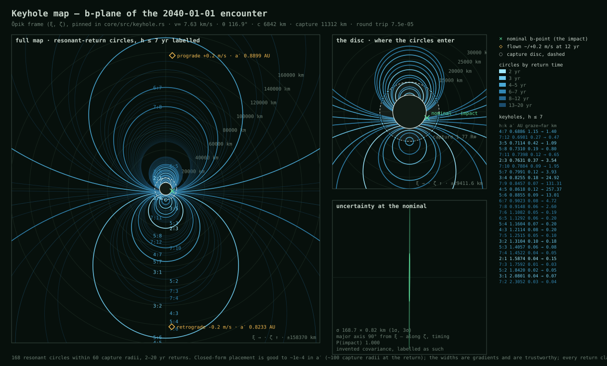

# Asteroid Deflection Simulator

An educational solar-system simulator for **planetary defense** — planning and
simulating missions to deflect an Earth-bound asteroid, built around a single
thesis it exists to make you *feel*:

> **Deflecting an asteroid early — many orbits before the predicted impact — is
> dramatically more effective than deflecting it on final approach.** A tiny nudge
> applied years out beats a massive shove applied days out.

The money screen is a plot of **required Δv vs. lead time**: that curve *is* the
thesis. You can attempt a last-minute deflection, watch it fail, rewind ten
years, tap the asteroid once with a small impulse, and watch Earth slide safely
out of the way.

This is built for **realism**, not a cartoon. The dynamics that decide hit-vs-miss
are modeled at ephemeris quality and validated against the same reference tools
professional planetary-defense work uses.

---

## Status

**The physics is complete through Tier 3.** The MVP (a validated Tier-1 encounter,
the honest hit→miss flip, the Δv-vs-lead-time curve, an egui viewer) shipped;
Phase 2 layered on the Godot 3D frontend, the full Tier-2 force model validated
term by term and against JPL Horizons on Apophis, the three deflection methods,
Lambert/porkchop mission design with launch vehicles, the threat orbit as a live
knob, and Tier 3 — orbit covariance mapped to the b-plane as an impact
*probability*, and now **keyholes**.

Since 2026-09-06 the uncertainty layer can also be driven by a **real** orbit
solution: `core/src/sbdb.rs` ingests JPL's published covariance for an actual
asteroid — cometary elements at their own epoch, in mixed units, with the
non-gravitational parameters marginalised out — and maps it to the b-plane.
Flown to Apophis' 2029 Earth flyby it gives a 1σ ellipse of **18.2 km × 0.48 km**
and an impact probability of **zero**, which is the correct answer. The number
worth reading beside it is our own: over the same arc our trajectory sits
**15.1 km** from JPL's. Real astrometric uncertainty and our own dynamical error
are the same size here, and the point of ingesting the first is that it makes the
second visible.

The keyhole work (2026-09) settled the last open physics question in the spec:
the b-plane's Öpik `(ξ, ζ)` frame and the b-vector sign are pinned by derivation
and by measurement, the resonant-return circles come out in closed form (proved
identical to the flyby rotation the project already modelled), and the **3:4
keyhole was flown with the propagator** — a 0.2165 m/s retrograde nudge twelve
years before the 2040 encounter sends the shipping rock through the flyby and
back to within 1 087 km of Earth's centre on 2042-12-31. The keyhole is an impact
keyhole, measured rather than asserted; a slightly coarser refinement of the same
shot — 1 130 km, from the solver's default iteration budget — is pinned as a
regression test.



*The b-plane of the 2040-01-01 encounter: Earth's gravitationally-focused capture
disc, the resonant-return circles (each a place where a miss sets up a return
`h` years later), the flown ±0.2 m/s deflections, and the uncertainty ellipse —
a needle **169 km long and 0.82 km across, lying 0.3° off ζ**, because along-track
uncertainty is timing uncertainty. An interactive version is generated at
`docs/keyhole_map.html`.*

That same ellipse is now on the **live** b-plane view: `[U]` orders the
sensitivity solve on a worker and holds it, so `[Z]`/`[X]` can ask the question
again at a better- or worse-known orbit for free. It reproduces the map's
168.710 × 0.818 km at 89.7° through an independent path, and at the default zoom
it is about **one pixel** — which the view says outright rather than fattening it,
because that smallness is the finding.

**What is next** (in order, spelled out in `HANDOFF.md` → *Where things stand*):
more flown resonances to calibrate the keyhole width's placement slack; then
Phase 3. Keyhole targeting, the impact probability near a keyhole, real orbit
covariances from the JPL Small-Body Database, and the Tier-3 ellipse on the Godot
b-plane view all landed in 2026-09 — as did the dop853→IAS15 question, which was
**retired by measurement** rather than built: dop853 is already converged where it
ships, and a second integrator has no oracle to prove anything against.

If you're reading the code: **`HANDOFF.md` is the source of truth** for *why*
things are the way they are, and **`DEVELOPING.md`** for how to build, test and
regenerate everything. This README is the summary.

---

## How it works

A **headless, deterministic Rust simulation core** is the single source of truth.
Every view and the mission planner are *consumers* of the core's state — they
never own state — so views stay in sync and every scenario is reproducible
(same build → same output). GDScript owns zero orbital mechanics.

The mission planner doesn't compute trajectories itself. It pushes a Δv into the
core's state at a chosen time and asks the core to re-propagate. *"Did this
mission work?"* = *"run, mutate, re-run, compare miss distance."*

### Physics, in tiers

Realism is switched on in composable tiers — each tier is just a set of *enabled
acceleration terms* in the force model, not a code rewrite:

- **Tier 0** — cosmetic Kepler context orbits (never used for hit/miss).
- **Tier 1** — the asteroid integrated as a *test particle* in the real JPL
  **DE440/441 ephemeris field** (Sun + 8 planets + Moon), in the barycentric ICRF
  frame, with an adaptive high-order integrator (dop853) and dense output.
  Hit/miss is decided by a proper **b-plane** geometry with a
  **gravitationally-focused capture radius** — Earth's gravity enlarges its own
  target (1.77 R⊕ at this encounter's 7.6 km/s) — not a naive geometric radius.
- **Tier 2** — real-asteroid fidelity: 1PN general relativity, the Yarkovsky
  thermal force, solar radiation pressure, Earth's J2, and the 16 main-belt
  asteroid perturbers (deliberately ASSIST's force model), each validated in
  isolation and the sum against Horizons on Apophis.
- **Tier 3** — uncertainty realism: a state covariance mapped through the real
  dynamics to the b-plane and integrated over the capture disc for an impact
  *probability*; and **keyholes** — the Öpik frame, resonant-return circles,
  keyhole widths, and a resonant return actually flown. This is what real
  planetary defense reasons about.

### Deflection methods

Modeled as a spectrum across lead time: **gravity tractor** (decades of lead, a
windowed force term with its own tow-duration solve), **kinetic impactor**
(`Δv = β·m·v / M`, with DART's measured β ≈ 3.6, delivered through real Lambert
transfers and launch vehicles), and **nuclear standoff** (energy → ablation →
momentum — modeled as deflection physics only, never weapon design).

### Two honesty caveats, surfaced in the UI

- **Delivery.** The porkchop layer makes the impulse *deliverable*: a launch
  window carries a `C3`, a payload for a named launcher, and an arrival velocity
  whose projection onto the asteroid's track is what actually deflects it.
  *Deliverable ≠ well-aimed*, and the map shows both.
- **Determinism.** The deterministic track is one line; real defense reasons over
  uncertainty. The Tier-3 layer turns that line into a probability, and labels
  the shipping rock's covariance as invented (a synthetic asteroid has no
  observation arc).

---

## Build vs. borrow

The project **builds its own astrodynamics** — propagator, integrators, force
model, Lambert solver, b-plane geometry, deflection models, uncertainty and
keyhole theory — because that's the part worth understanding deeply. It
**borrows** only where a reinvented bug would be silent and catastrophic:

| Concern | Crate | License |
|---|---|---|
| Time (TDB/TT/UTC, leap seconds) | `hifitime` | MPL-2.0 |
| Ephemerides, frames, GM constants | `ANISE` | MPL-2.0 |
| Linear algebra (f64 everywhere) | `nalgebra` | Apache-2.0/MIT |

Validation reference tools — `hapsira`, `REBOUND`, `ASSIST`, `GRSS`, `astropy`,
`nyx` — run **offline only** in a Python fixture pipeline (`pyref/`). Their
copyleft licenses don't constrain this project because nothing is linked into the
shipped binary; only their *generated data* is committed as fixtures.

## Validation

Correctness is checked against an **oracle ladder** matched to the regime — free
invariants (energy / angular momentum / LRL conservation) → analytic Kepler →
REBOUND → **ASSIST** (the trajectory oracle: a two-year track reproduced to
~4.5e-11 relative, ~20 m) → JPL Horizons on real asteroids. Each force term is
validated *in isolation* (the GR term alone reproduces Mercury's 42.98″/century
perihelion precession; J2 the closed-form nodal regression), not just the sum.
The Tier-3 machinery is validated against exact maps and closed forms
(a Rayleigh integral, the Valsecchi resonant-circle formula) and then against
flown trajectories in the real field. The SBDB covariance conversion is gated
three ways against JPL's own numbers rather than by a round-trip — a round-trip
runs one unit convention in both directions, so a degrees-for-radians error
cancels exactly and it passes.

The physics tests need the JPL kernels and **skip green without them** — run
`python tools/fetch_kernels.py` once and `ASTEROID_REQUIRE_KERNELS=1 cargo test
--workspace --release` so a green run means the physics ran. CI does exactly
that.

---

## Layout

```
workspace/
├── core/          # asteroid_core — pure simulation engine, no renderer dependency
│   ├── src/forces/     # composable terms: point mass, 1PN, Yarkovsky, SRP, J2, tractor
│   ├── src/perturber_field.rs, integrator.rs, clock.rs, close_approach.rs, geometry.rs
│   ├── src/deflection.rs, lambert.rs, mission.rs, launch_vehicle.rs, scenario.rs
│   ├── src/uncertainty.rs  # Tier 3: covariance → b-plane → P(impact)
│   ├── src/keyhole.rs      # Tier 3: Öpik frame, resonant circles, keyhole widths
│   └── examples/           # probes — measurement programs, one question each
├── validation/    # oracle-ladder tests over committed pyref fixtures
├── pyref/         # offline fixture generators (GPL oracles, never linked)
├── viewer/        # egui MVP viewer + the Δv-curve cache builder
├── godot/         # Godot 4.7 frontend; godot/rust is the gdext binding → core
├── tools/         # kernel fetcher, keyhole-map renderers (SVG, HTML)
├── docs/          # generated keyhole map (JSON, SVG, HTML)
└── memory/        # the assistant's project memory, mirrored for transparency
```

## Roadmap

- **MVP** — ✅ prove the thesis in pure Rust: Tier-1 encounter, honest hit→miss
  flip, the Δv-vs-lead-time curve, kinetic impactor.
- **Phase 2** — ✅ Godot 3D frontend; Tier-2 realism; real NEOs (Apophis, Bennu,
  Didymos as Horizons scenery, Apophis as the validation capstone); nuclear +
  gravity-tractor methods; Lambert/porkchop mission design; Tier-3 uncertainty,
  keyholes, keyhole targeting, and real JPL orbit covariances. Remaining inside
  Phase 2: the Tier-3 ellipse on screen.
- **Phase 3** — launch vehicles & payload budgets (the vehicles and mass solves
  exist; the budgets and orbital assembly do not), standing defense systems,
  multi-mission campaigns.

See [`HANDOFF.md`](HANDOFF.md) for the complete spec, the locked decisions, the
known hard problems, and the dated record of every batch; [`DEVELOPING.md`](DEVELOPING.md)
for the commands.

---

## License

Licensed under the **Boyko Non-Commercial License v1.0 (BNCL-1.0)** — see
[`LICENSE`](LICENSE) and [`NOTICE`](NOTICE).

Free to use, modify, and distribute for **non-commercial purposes**. Commercial
use requires separate written permission from the copyright holder.
